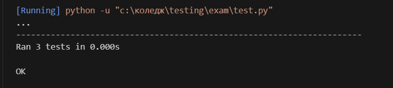

# Білет 4
Завдання: У файлі main.py створіть клас Calculator з методами add(a, b) та divide(a, b). Метод ділення має обробляти ділення на нуль. Тест: У файлі test.py протестуйте обидва методи, зокрема перевірте реакцію на ділення на нуль.
## Приклад виконання
- запускаємо програму:
  ```bash
  python main.py
  ```
- запускаємо тести:
```bash
Python test.py
```
- результат
