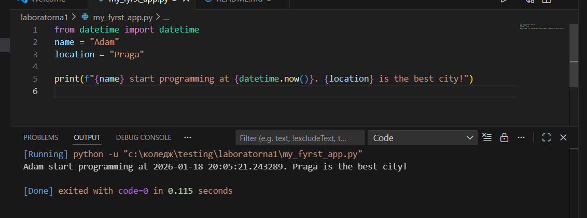
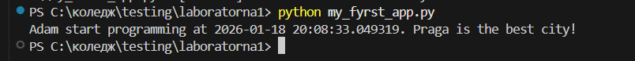
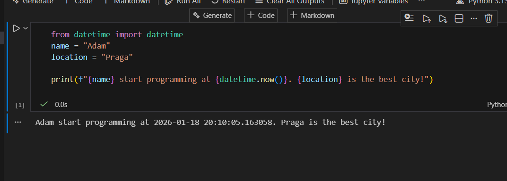
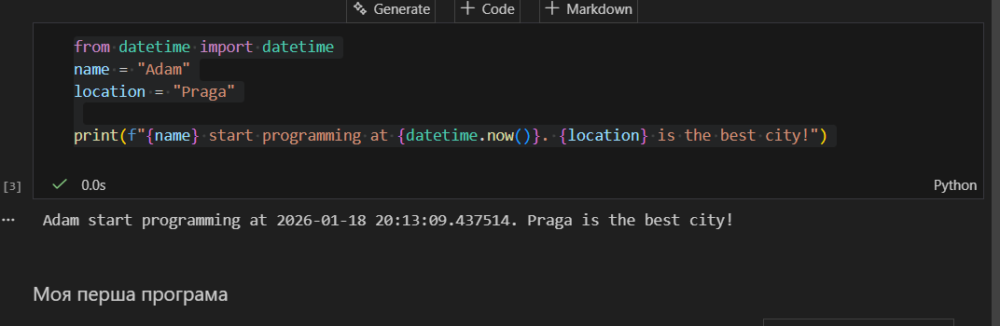

# Звіт до роботи
## Тема: _згідно теми_
### Мета роботи: _згідно теми_

---
### Виконання роботи
* Результати виконання завдання *1...N*;
    1. Розробили/Створили ...
    1. Програма вивела значення ...
    1. Отримано наступні результати ...
    1. Навчились ...
* вставлені рисунки
       
        -2ий спосіб

        - ipynb
     - додавання markdown під кодом(як заголовок)
* через локальні шляхи 

* вставлений код / текстовий або числовий результат / інші результати:
    - так можна вставляти код, або просто вствляйте посилання на файл з програмою;
    ```python
    def simple_function_example():
        pass
    ```
    - якщо потрібно виділити текст, тоді:
    ```text
    << Тут можна писати те що хочемо виокремити >>
    ```

* результати виконання індивідуального завдання (якщо такі є);

---
* Відповідь ШІ на запитання:яку б першу програму написав АІ та чи б міг АІ пояснити її?
```
Якби я був новачком і тільки починав вчити Python, моя перша програма була б максимально простою, але корисною 🙂

1️⃣ Класика — “Hello, world!”

Це перший крок, щоб зрозуміти, що код працює:

print("Hello, world!")

Що тут відбувається?
🔹 print

print — це команда для Python

Вона означає: “покажи це на екрані”

Уяви, що ти кажеш комп’ютеру:

«Виведи щось на екран»

🔹 ("Hello, world!")

Текст в лапках — це просто повідомлення

Лапки " " показують Python, що це текст, а не команда

👉 Без лапок Python подумав би, що Hello — це назва змінної, і виникла б помилка.
```
### Висновок:
> у висновку потрібно відповісти на запитання:

- :question: Що зроблено в роботі;
- :question: Чи досягнуто мети роботи;
- :question: Які нові знання отримано;
- :question: Чи вдалось відповісти на всі питання задані в ході роботи;
- :question: Чи вдалося виконати всі завдання;
- :question: Чи виникли складності у виконанні завдання;
- :question: Чи подобається такий формат здачі роботи (Feedback);
- :question: Побажання для покращення (Suggestions);

---