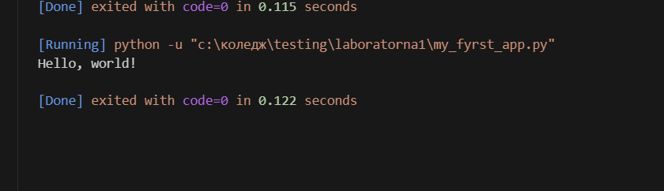

# Звіт до роботи

## Тема:  
Вступні заняття: налаштування середовища, прочаток роботи з Python та Markdown;

### Мета роботи:  
Налаштувати середовище роботи VS Code, створити репозиторій Github та налаштувати інтеграцію з ним, написати першу програму на Python та створити звіт з використанням форматування Markdown;

---

### Виконання роботи
*Результати виконання завдання *1*:
1. Налаштовано середовище розробки Visual Studio Code для роботи з мовою програмування Python.
2. Створено репозиторій на платформі GitHub та налаштовано інтеграцію з локальним середовищем.
3. Написано та виконано першу програму мовою Python, у результаті чого на екран було виведено тестове повідомлення.
4. Отримано початкові навички роботи з форматуванням Markdown та оформлення звітної документації.

* вставлені рисунки  
         
        -2ий спосіб  

        - ipynb  

     - додавання markdown під кодом(як заголовок)  

     - відповідь ШІ  

* вставлений код / текстовий або числовий результат / інші результати:
    - так можна вставляти код, або просто вствляйте посилання на файл з програмою;
    ```python
    def simple_function_example():
        pass
    ```
    - якщо потрібно виділити текст, тоді:
    ```text
    << Тут можна писати те що хочемо виокремити >>
    ```

* результати виконання індивідуального завдання (якщо такі є);

---

* Відповідь ШІ на запитання: яку б першу програму написав АІ та чи б міг АІ пояснити її?

```
Якби я був новачком і тільки починав вчити Python, моя перша програма була б максимально простою, але корисною 🙂

1️⃣ Класика — “Hello, world!”

Це перший крок, щоб зрозуміти, що код працює:

print("Hello, world!")

Що тут відбувається?
🔹 print

print — це команда для Python

Вона означає: “покажи це на екрані”

🔹 ("Hello, world!")

Текст в лапках — це просто повідомлення

Лапки " " показують Python, що це текст, а не команда
```
### Висновок:

У ході виконання роботи було налаштовано середовище розробки VS Code, створено репозиторій GitHub та виконано перші кроки роботи з мовою програмування Python і форматуванням Markdown.  

Мету роботи було досягнуто, оскільки всі поставлені завдання виконано. У процесі роботи отримано нові знання щодо налаштування середовища розробки, створення та використання репозиторіїв GitHub, а також написання та пояснення простої програми на Python.  

На всі питання, поставлені в ході виконання роботи, було надано відповіді. Усі завдання вдалося виконати, значних труднощів у процесі роботи не виникло.  

Такий формат здачі роботи є зручним і зрозумілим, оскільки дозволяє наочно поєднувати текст, код і зображення.
