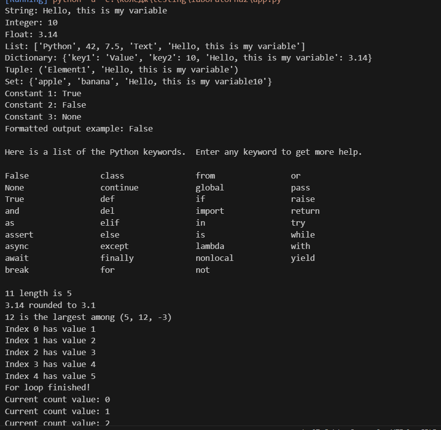
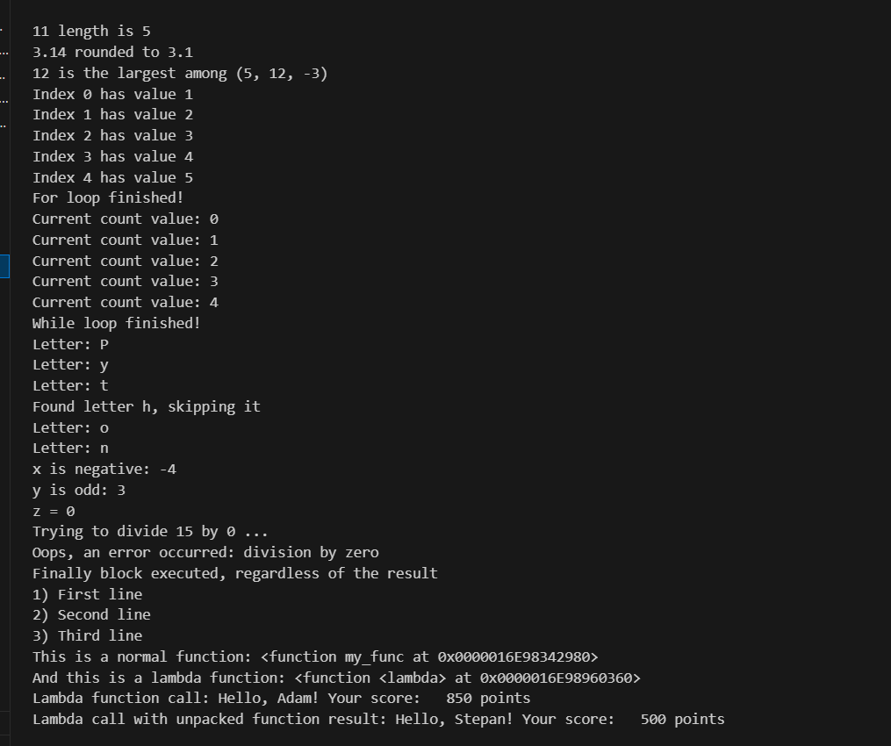
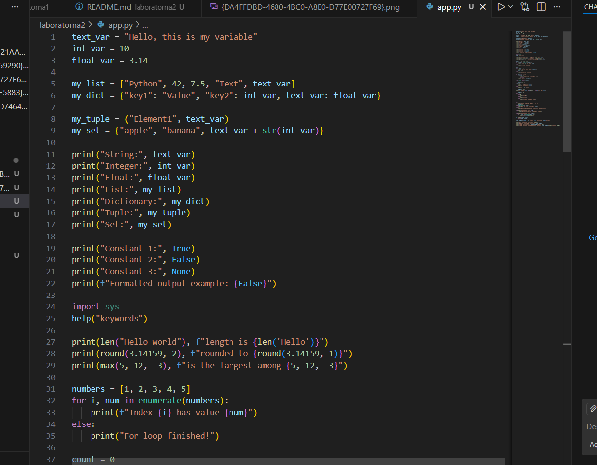
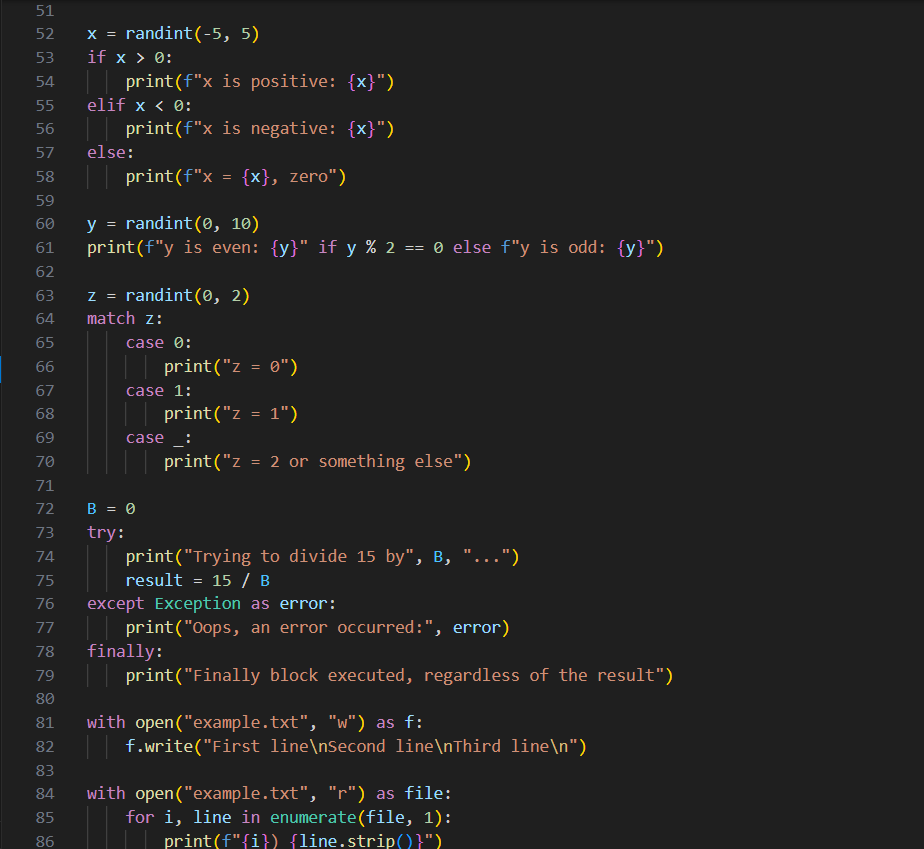

# Звіт до роботи

## Тема:  
Основи програмування на Python: типи даних, цикли, розгалуження, функції та лямбда-функції;

### Мета роботи:  
Навчитись застосовувати основні конструкції мови Python, виконати всі приклади та з використанням AI створити власні приклади які демонструють особливості кодових конструкцій Pyhton

---

### Виконання роботи
*Результати виконання завдання *2*:
1. Попрактикувався з базовими типами даних Python: рядки, числа, списки, словники, кортежі та множини.
2. Виконав приклади з вбудованими константами, зарезервованими словами та функціями Python.
3. Ознайомився з циклами `for` та `while`, написав власні приклади з умовами та операторами `continue` і `else`.
4. Створив приклади з умовними конструкціями `if-elif-else` та `match-case`.
5. Виконав роботу з конструкцією `try-except-finally` для обробки помилок.
6. Використав контекст-менеджер `with` для роботи з файлами.
7. Написав та використав власні функції та лямбда-функції.

* Вставлені рисунки:  
    
      
      
      
      

* Вставлений код / текстовий або числовий результат / інші результати:
    - Код можна вставляти напряму або посиланням на файл `.py`:
    ```python
    text_var = "Hello, this is my variable"
    int_var = 10
    float_var = 3.14

    my_list = ["Python", 42, 7.5, "Text", text_var]
    my_dict = {"key1": "Value", "key2": int_var, text_var: float_var}
    my_tuple = ("Element1", text_var)
    my_set = {"apple", "banana", text_var + str(int_var)}
    print("String:", text_var)
    print("Integer:", int_var)
    print("Float:", float_var)
    print("List:", my_list)
    print("Dictionary:", my_dict)
    print("Tuple:", my_tuple)
    print("Set:", my_set)
    ```
    - Для виділення тексту:
    ```text
    << Тут можна писати коментарі або пояснення >>
    ```

* Результати виконання індивідуального завдання (якщо такі є);

---
*Відповдіь ШІ на пиатння:як би він розписав про основи Python:
```
1️⃣ Що таке Python і Jupyter Notebook

Python — це високорівнева мова програмування, яка легка для навчання і дуже гнучка.

Jupyter Notebook — це інтерактивне середовище, де можна писати код, одразу його виконувати і бачити результати.

Тобі подобається, що можна поєднувати текст, код і графіки в одному файлі.

У Jupyter Notebook:

Комірка з кодом → виконується через Shift + Enter

Комірка з текстом → можна писати пояснення або заголовки (Markdown)

2️⃣ Змінні та типи даних

Python не потребує оголошення типу змінної. Тип визначається автоматично.

# числа
x = 10        # int
y = 3.14      # float

# рядки (тексти)
name = "Anna"

# логічні значення
is_student = True


Ти можеш дізнатися тип змінної через type():

print(type(x))  # <class 'int'>
print(type(name))  # <class 'str'>

3️⃣ Операції з числами
a = 10
b = 3

print(a + b)  # додавання
print(a - b)  # віднімання
print(a * b)  # множення
print(a / b)  # ділення → завжди float
print(a // b) # цілочисельне ділення
print(a % b)  # залишок від ділення
print(a ** b) # піднесення до степеня

4️⃣ Робота з рядками
text = "Привіт"
name = "Анна"

# конкатенація (складання рядків)
greeting = text + " " + name
print(greeting)

# повторення рядка
print(text * 3)

# індексація (перший символ - 0)
print(name[0])  # 'А'
print(name[-1]) # останній символ

5️⃣ Списки (List)

Списки — це змінні, які можуть зберігати кілька елементів:

numbers = [1, 2, 3, 4, 5]
fruits = ["яблуко", "банан", "вишня"]

# доступ до елементів
print(numbers[0])  # 1
print(fruits[-1])  # вишня

# додавання елементів
fruits.append("апельсин")
print(fruits)

# видалення елементів
fruits.remove("банан")
print(fruits)

6️⃣ Умови (if / else)
age = 18

if age >= 18:
    print("Ти дорослий")
else:
    print("Ти ще дитина")


== → перевірка на рівність

!= → не дорівнює

> , < , >= , <= → більше, менше, і так далі

7️⃣ Цикли
Цикл for
for i in range(5):  # від 0 до 4
    print(i)

for fruit in fruits:
    print(fruit)

Цикл while
count = 0
while count < 5:
    print("count =", count)
    count += 1

8️⃣ Функції

Функції допомагають об’єднати код в блоки, які можна використовувати багаторазово:

def greet(name):
    return "Привіт, " + name + "!"

print(greet("Анна"))

9️⃣ Імпорт бібліотек

Python має багато готових бібліотек:

import math

print(math.sqrt(16))  # квадратний корінь


Або для науки та графіків:

import numpy as np
import matplotlib.pyplot as plt

x = np.linspace(0, 10, 100)
y = np.sin(x)

plt.plot(x, y)
plt.show()

🔟 Корисні поради для роботи в Jupyter

Shift + Enter → виконати комірку

Ctrl + / → закоментувати виділений код

Можна вставляти Markdown для нотаток:

# Заголовок
**жирний текст**


Використовуй автозавершення — Tab після назви змінної або функції
```

* Відповідь ШІ на запитання: яку б першу програму написав АІ та чи міг би АІ пояснити її?


### Висновок:

У ході виконання роботи були освоєні базові конструкції мови Python: типи даних, цикли, розгалуження, функції та лямбда-функції. Було створено власні приклади, протестовано їх та оформлено результати у звіті з використанням Markdown.  

Мету роботи досягнуто, оскільки всі поставлені завдання виконано. В ході роботи отримано нові знання щодо базових можливостей Python та практичного застосування команд для обробки даних і роботи з файлами.  

Формат здачі роботи виявився зручним і наочним, оскільки дозволяє поєднувати код, результати виконання та пояснення в одному документі.
