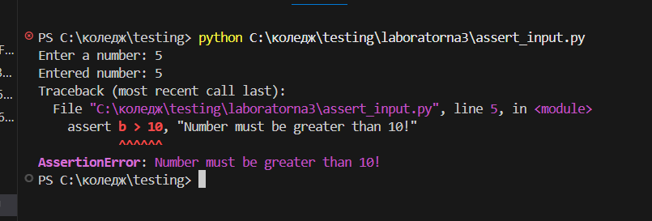
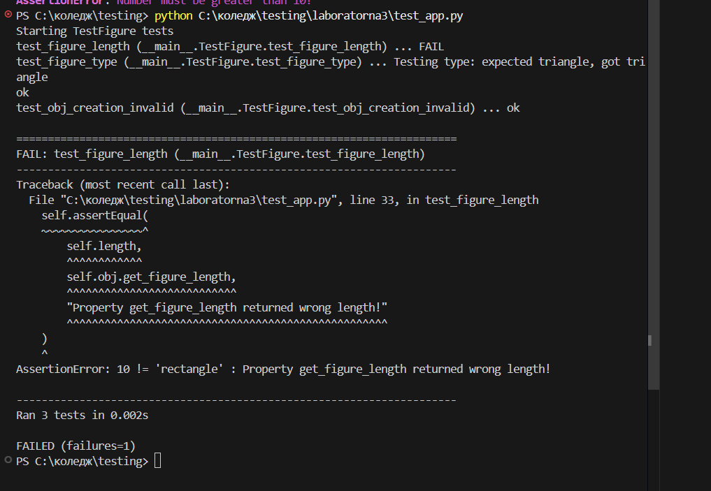
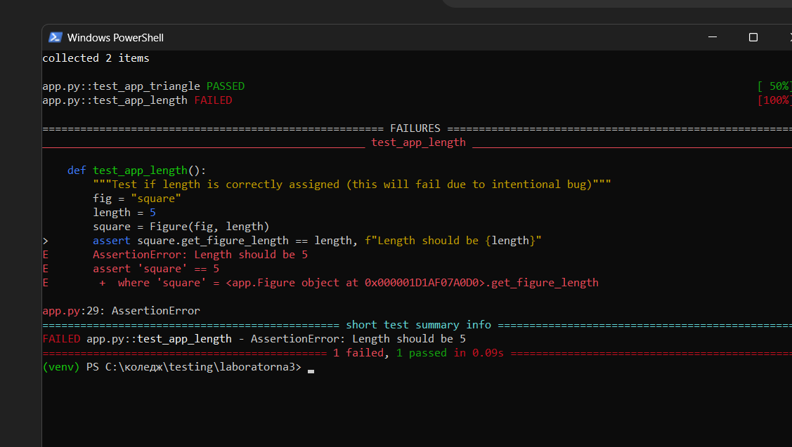
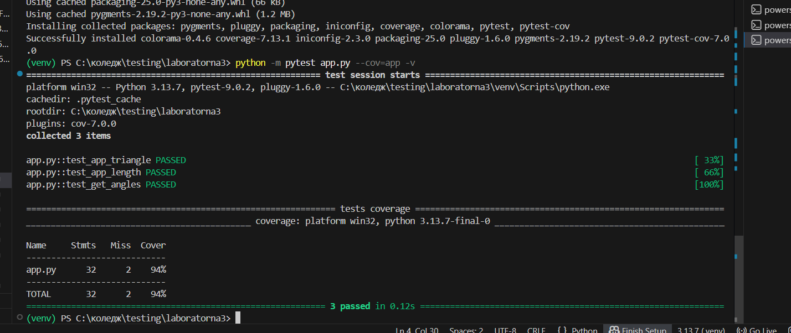
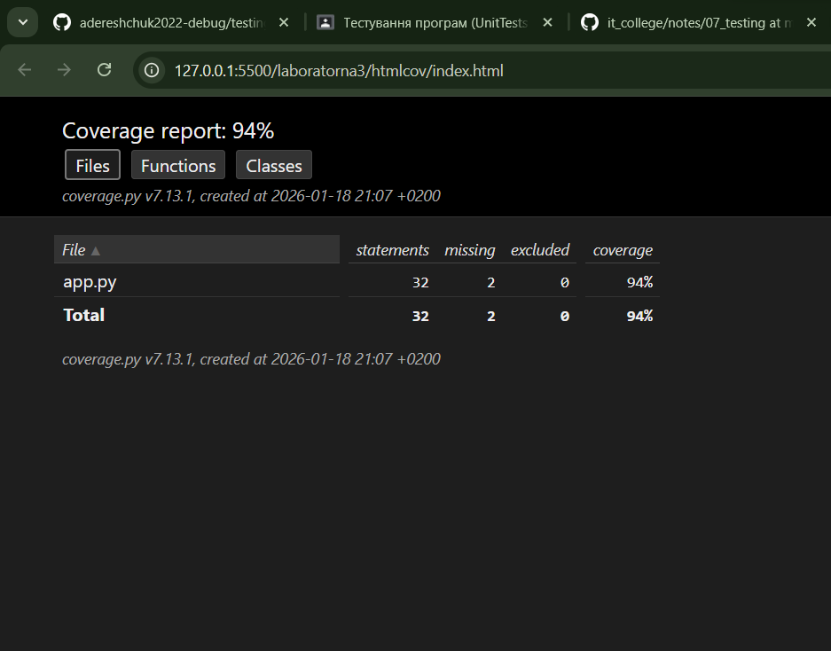

# Звіт до роботи
## Тема:  
Тестування програм (UnitTests та PyTests)

### Мета роботи:  
Навчитись застосовувати методи юніт-тестування у Python, ознайомитись з бібліотекою PyTest, перевіряти правильність роботи функцій та класів, а також аналізувати покриття коду тестами.

---

### Виконання роботи 
* Результати виконання лабоаторної роботи *3*:
    1. Ознайомився з базовими методами тестування у Python за допомогою `assert`.
    2. Створив класи та функції для перевірки правильності роботи коду:
    ```python
    class Figure:
        def __init__(self, type, length) -> None:
            assert length > 0, "Length must be greater than 0!"
            assert type in ["square", "rectangle", "triangle"], "Allowed figures: square, rectangle, triangle"
            self.type = type
            self.length = length

        @property
        def get_figure_length(self):
            return self.length

        @property
        def get_angles(self):
            if self.type in ["square", "rectangle"]:
                return 4
            if self.type == "triangle":
                return 3
    ```
    3. Створив юніт-тести з використанням PyTest:
    ```python
    def test_app_triangle():
        fig = "triangle"
        triangle = Figure(fig, 4)
        assert triangle.type == fig, f"Figure should be {fig}"

    def test_app_length():
        fig = "square"
        length = 5
        square = Figure(fig, length)
        assert square.get_figure_length == length, f"Length should be {length}"

    def test_get_angles():
        fig = "triangle"
        triangle = Figure(fig, 1)
        assert triangle.get_angles == 3, f"{fig} should have 3 angles"
    ```
    4. Виконав запуск тестів через PyTest та перевірив результати:
    ```bash
    python -m pytest app.py -v
    ```
    5. Проаналізував результати тестів, один із тестів (`test_app_length`) був проваленим через навмисну помилку.
    6. Ознайомився з бібліотекою `coverage` для аналізу покриття коду тестами:
    ```bash
    python -m coverage run -m pytest
    python -m coverage report
    python -m coverage html
    ```
    7. Візуалізував покриття коду у браузері, дослідив файли `.html`.

* Вставлені рисунки (скріншоти виконаних тестів та результатів coverage):
   
     
     
     
     
      

* Вставлений код / текстовий результат / інші результати:
    ```text
    << Тест test_app_triangle пройшов успішно, тест test_app_length провалився, test_get_angles пройшов успішно >>
    ```

* Результати виконання індивідуального завдання:
    - Створено додаткові перевірки через `assert` у конструкторі класу.
    - Додано нову проперті `get_angles` та юніт-тест для неї.
    - Перевірено роботу з неправильними параметрами (ValueError або AssertionError).

---

### Висновок:

У ході виконання роботи освоєно основи юніт-тестування у Python. Було створено класи та функції з перевірками через `assert`, написано юніт-тести через PyTest, виконано тестування та проаналізовано результати. Також використано Coverage для оцінки покриття коду тестами.  

Мета роботи досягнута: освоєно тестування функцій та класів у Python, проведено аналіз результатів тестів та покриття коду.  

Отримано нові знання про бібліотеку PyTest, структуру юніт-тестів, використання `assert`, перевірку правильності коду та створення тестів для класів і функцій. Оволодіто практикою роботи з Coverage для оцінки покриття коду тестами.  

Усі поставлені питання в ході роботи виконано, всі практичні завдання успішно реалізовані та протестовані.  

Під час виконання завдання виникла невелика складність із запуском PyTest на Windows, яку вирішено використанням команди `python -m pytest`.  

Формат здачі роботи виявився зручним, оскільки Markdown-звіт дозволяє поєднувати код, результати виконання та пояснення в одному документі.  

Для покращення роботи можна додати більше практичних прикладів з помилками та перевірками виключень, щоб глибше освоїти роботу з тестуванням.
